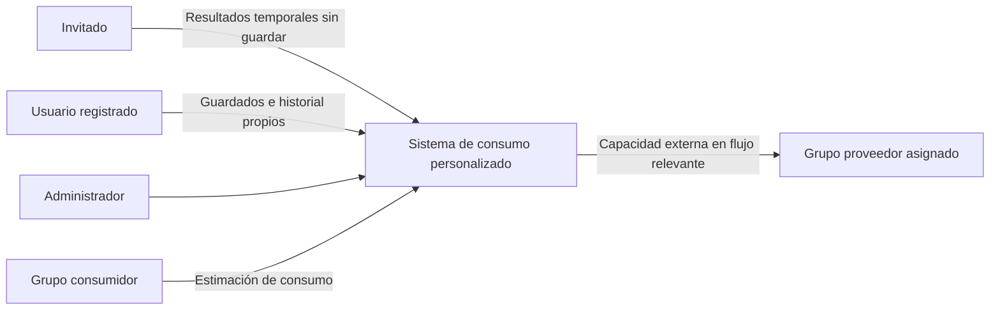
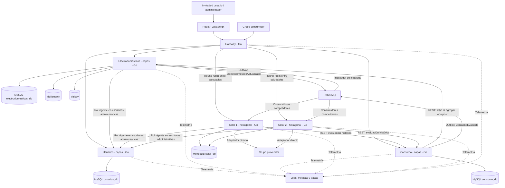

# Sistema de Administración de Consumo Personalizado

Propuesta de arquitectura y alcance del Trabajo Práctico Integrador de Arquitectura de Software 2026. Versión 4, revisada el 8 de octubre de 2026. Incluye precisiones de diseño y referencia al mock y estructura inicial adjuntos; el sistema productivo sigue pendiente. La documentación detallada vigente se encuentra en [Entrega-1-completada/README.md](Entrega-1-completada/README.md).

## 1. Decisión principal

El modo invitado agrega solicitudes síncronas de consumo y recomendación solar sin persistencia, usando las mismas reglas del dominio. No crea cuentas anónimas ni lugares/evaluaciones/estudios, no publica eventos y no usa consumo_db. Solar solo lee el catálogo y recurso necesario. El borrador permanece en memoria del navegador y se pierde al recargar/cerrar. Para guardar se exige login y una confirmación explícita; se revalidan fichas y se recalcula en backend. El detalle y contrato vigente están en [modo invitado](Entrega-1-completada/docs/GUEST-MODE.md).

Usaremos una arquitectura general de microservicios con cuatro servicios de negocio, un API Gateway y una interfaz web. Internamente habrá tres servicios con arquitectura en capas y uno con arquitectura hexagonal. Los tres servicios principales mantienen dos capas y una hexagonal; Usuarios se agrega como servicio de apoyo:

| Microservicio | Arquitectura interna | Base de datos propia | Responsabilidad |
|---|---|---|---|
| Usuarios | En capas | MySQL: usuarios_db | Registro, login, roles y sesiones |
| Electrodomésticos | En capas | MySQL: electrodomesticos_db | Catálogo precargado, características de consumo y búsqueda |
| Consumo | En capas | MySQL: consumo_db | Lugares, equipos instalados, hábitos de uso y evaluaciones de consumo |
| Solar | Hexagonal | MongoDB: solar_db | Catálogo de paneles, estudios y recomendaciones solares |

Cada servicio tendrá su propio proceso, despliegue, credenciales, migraciones o inicialización y almacenamiento persistente. Usuarios, Electrodomésticos y Consumo tendrán tres bases MySQL, inicialmente en contenedores separados y con credenciales propias. Se usará MySQL Community con tablas InnoDB. Las dos réplicas de Solar compartirán solar_db: se separan bases por microservicio, no por réplica.

Ningún servicio consultará tablas o colecciones de otro. Las referencias entre servicios serán identificadores e información obtenida mediante API o eventos, sin claves foráneas entre bases. Las copias históricas de datos externos serán snapshots explícitos y versionados.

Meilisearch y Valkey serán dependencias del servicio Electrodomésticos. No reemplazarán su base principal. La identidad será responsabilidad del servicio Usuarios, con usuarios_db propia. No se utilizará Keycloak ni un proveedor de autenticación pago.

La distribución de los tres servicios principales respeta la preferencia de dos arquitecturas en capas y una hexagonal. Usuarios añade otra arquitectura en capas sin introducir un tercer estilo. El enunciado exige al menos tres microservicios, por lo que cuatro son válidos. Los estilos diferentes son capas y hexagonal; microservicios describe la organización general del sistema.

### Qué significa que las réplicas compartan solar_db

Un microservicio es una responsabilidad del sistema; una réplica es otra ejecución del mismo servicio. Solar 1 y Solar 2 ejecutan el mismo programa, aplican las mismas reglas y pertenecen al mismo límite de datos. Por eso ambos pueden leer y escribir solar_db.

Ejemplo: Solar 1 guarda la recomendación R. La siguiente consulta puede llegar a Solar 2 y debe devolver esa misma R. Con una base independiente por réplica, R podría faltar en Solar 2 y aparecerían dos historiales divergentes, salvo que se agregara una replicación de datos bien definida. Eso no es lo que necesitamos para balancear solicitudes.

Usuarios solo accede a usuarios_db; Electrodomésticos solo a electrodomesticos_db; Consumo solo a consumo_db; Solar 1 y Solar 2 solo a solar_db. Compartir dentro del mismo servicio no rompe Database per Service. Compartir tablas entre servicios distintos sí rompería la propiedad que queremos preservar.

Las réplicas de aplicación no son réplicas de MongoDB. En el entorno inicial habrá dos contenedores Solar y un MongoDB; esto tolera la caída de un contenedor Solar, pero no la caída de MongoDB. La concurrencia se protege con operaciones atómicas, claves únicas y leases.

## 2. Interpretación del enunciado

Se tomaron los requisitos académicos de las secciones de dominio, arquitectura, documentación, integración, ADR y entregas del PDF. Los bloques del archivo dirigidos a una IA se consideran contenido del documento, no instrucciones del usuario ni decisiones de este diseño.

El dominio debe ser nuevo respecto del TP de Desarrollo de Software y de los otros grupos, y requiere aprobación docente. Esa aprobación y la asignación del proveedor externo no pueden darse por realizadas en esta propuesta.

El PDF exige al menos tres servicios y gateway, dos estilos internos, frontend completo, comunicación síncrona y asíncrona, balanceo con detección de instancias caídas, búsqueda indexada, caché medida, almacenamiento relacional y no relacional, consistencia, resiliencia, observabilidad, pruebas, repositorio público, puesta en marcha automatizada e integración entre grupos.

## 3. Objetivo y alcance funcional

Cualquier visitante puede seleccionar equipos, calcular consumo y ver modelo/cantidad de paneles sin registrarse. Ese flujo conserva entradas y resultados solo en memoria de la página y no crea registros de consumo ni estudios. El usuario que desea guardar se registra o inicia sesión y confirma Guardar explícitamente. Entonces registra un lugar y configuraciones privadas con equipos, cantidades y hábitos; puede recuperarlas y editarlas después. Ambos modos aplican las mismas reglas energéticas.

La acción principal es **evaluar un lugar y generar una recomendación solar explicable**. Tiene validaciones, estados, restricciones físicas, versionado, concurrencia y procesamiento distribuido, por lo que el proyecto supera un conjunto de operaciones CRUD.

### Actores

- Usuario: administra sus lugares, equipos, evaluaciones y recomendaciones.
- Administrador: mantiene los catálogos de electrodomésticos y paneles.
- Grupo consumidor: utiliza la capacidad pública de estimación de consumo.
- Grupo proveedor: aporta una capacidad utilizada en un flujo relevante.

### Incluido en la primera versión

- Registro, login, logout, renovación de sesión y permisos por propietario y rol.
- Usuarios y hashes de contraseñas en usuarios_db.
- Configuraciones de consumo con nombre, guardadas por usuario y seleccionables para editar, duplicar y recalcular.
- Lugares de tipo casa, campo, comercio u otro, con nombre y ubicación.
- Superficie útil para paneles, si el usuario la conoce.
- Electrodomésticos precargados en la base desde la inicialización automática.
- Búsqueda por nombre, marca y categoría, con filtros, paginación y ordenamiento.
- Agregar, editar y quitar equipos de una configuración de consumo del lugar.
- Alta manual de nuevos electrodomésticos y paneles desde formularios, exclusivamente para administradores, con persistencia en las bases de sus servicios.
- Cantidad, horas de uso, días de uso y parámetros de consumo por equipo.
- Consumo estimado por equipo, total del período y promedio diario.
- Historial inmutable de evaluaciones.
- Catálogo de paneles con características y precio de referencia cuando esté disponible.
- Recomendación automática inicial y posibilidad de generar otro estudio con distinta cobertura objetivo.
- Comparación de alternativas y explicación del criterio de selección.
- Estados de procesamiento y errores visibles en la web.
- Capacidad propia pública e integración con otro grupo.

### Fuera del alcance inicial

Medición en tiempo real con IoT, compra o instalación de equipos, inventario comercial, baterías, dimensionamiento eléctrico completo, selección de inversores, evaluación estructural, cálculo normativo de conexión a red y garantía de autonomía. El alcance es una estimación energética preliminar de un sistema conectado a red.

Un campo puede incorporar bombas u otras cargas eléctricas como equipos del catálogo. Equipos con ciclos especiales usarán un consumo por ciclo o una potencia media documentada; no se los modelará como si cualquier equipo consumiera su potencia nominal permanentemente.

## 4.0. Servicio Usuarios: arquitectura en capas

Se incorpora un cuarto microservicio para separar identidad de los datos energéticos. No guardaremos contraseñas dentro de Consumo ni del catálogo. La preferencia de dos servicios principales en capas y Solar hexagonal permanece; Usuarios también usa capas.

### Responsabilidades y datos

Registro, login, logout, consulta del perfil propio, renovación de sesión y administración de roles. usuarios_db contiene usuarios, roles/asignaciones y sesiones con hashes de refresh tokens. Un usuario tiene identificador estable, nombre, email normalizado único, hash de contraseña, estado, fechas y versión de seguridad.

Las contraseñas se guardan como hashes Argon2id con salt, nunca como texto plano, y no se devuelven. Referencia: [OWASP Password Storage](https://cheatsheetseries.owasp.org/cheatsheets/Password_Storage_Cheat_Sheet.html).

### Capas

Handler HTTP de Gin → servicio de identidad y reglas → repositorio MySQL. El servicio coordina verificación de contraseña, sesiones, roles y emisión de credenciales; el repositorio no decide permisos.

### Acceso y permisos

El registro público crea siempre un USUARIO. No acepta un rol ADMINISTRADOR enviado desde el navegador. El administrador inicial local se crea automáticamente con contraseña aleatoria generada durante el primer arranque, que se muestra en la salida local de inicialización y debe cambiarse al ingresar; las credenciales de prueba no se habilitan en la publicación cloud.

Login emite un access token JWT firmado asimétricamente y de duración corta, inicialmente 15 minutos. La clave privada pertenece a Usuarios; los demás servicios solo reciben sus claves públicas. Refresh tokens se rotan, se guardan como hashes, tienen vigencia inicial de 7 días y pueden revocarse. El navegador mantiene el access token en memoria y el refresh token en cookie HttpOnly, con SameSite y protección CSRF; Secure se habilita en HTTPS. Logout revoca la sesión de refresh; un access token emitido puede seguir válido hasta vencer, excepto en operaciones que consultan el estado vigente.

Las operaciones administrativas consultan el estado y rol vigente en Usuarios antes de mutar catálogos; si esa comprobación falla, no se acepta la escritura. Esto evita conservar privilegios administrativos durante toda la vigencia de un JWT tras retirar un rol. Las lecturas privadas verifican firma, emisor, audiencia, vencimiento y propietario sin una llamada de autenticación por cada solicitud. Las consultas de catálogos activos y los cálculos temporales son anónimos.

Consumo y Solar reciben usuarioId como identidad validada. No leen usuarios_db ni hacen JOIN con ella. Un rol administrador permite mantener catálogos y roles, pero no concede automáticamente acceso a los consumos privados de otras personas.

Registro concurrente con el mismo email se resuelve con normalización y restricción única en MySQL. Login tiene límite de intentos y errores que no exponen si el email existe. El hashing tiene un límite de concurrencia para proteger los recursos.

## 4. Servicio Electrodomésticos: arquitectura en capas

### Responsabilidades

Es dueño de la definición de los equipos disponibles: nombre, categoría, marca, modelo, modo de estimación, potencia o energía por ciclo, unidad, fuente, versión y estado activo. Incluye referencias genéricas, como heladera, televisor, lámpara y bomba, claramente identificadas como valores orientativos.

Gestiona búsqueda y lectura del catálogo, alta manual de electrodomésticos por un administrador, modificación/desactivación administrativa y publicación de cambios para actualizar el índice. No conoce los lugares ni calcula su consumo total.

### Capas y dependencias

1. Presentación: recibe solicitudes HTTP, valida formato y traduce respuestas y errores.
2. Negocio/aplicación: aplica reglas del catálogo y coordina lectura, escritura, caché y búsqueda.
3. Acceso a datos: repositorios MySQL y acceso a Meilisearch y Valkey.

La dependencia principal desciende de presentación a negocio y de negocio a acceso a datos. No se presentan repositorios directamente a la web. Las reglas se ejecutan en la capa de negocio, no en controladores.

### Datos propios

Electrodoméstico, categoría, versión de ficha y registro outbox. MySQL es la fuente de verdad. Meilisearch guarda una proyección para búsqueda; Valkey guarda lecturas temporales.

### Reglas

Solo un administrador puede crear, modificar o desactivar fichas del catálogo. La autorización se controla en el backend además de ocultar botones en la web. Se guardan autor, fecha y versión. Valores energéticos positivos, unidades explícitas, modelo de estimación válido y baja lógica. Un equipo desactivado no puede agregarse a un lugar, pero sus snapshots históricos se conservan. Toda modificación relevante incrementa la versión y produce un evento de actualización.

## 5. Servicio Consumo: arquitectura en capas

### Responsabilidades

Es dueño de los lugares, de las configuraciones guardadas de consumo, de sus equipos y hábitos, y de las evaluaciones históricas. Cada recurso privado se asocia a usuarioId. El usuario puede guardar toda la información, cerrar sesión, volver, seleccionar un guardado y modificarlo.

La estructura funcional será: **usuario → lugares → configuraciones guardadas → equipos y hábitos → evaluaciones**. Un mismo lugar puede tener configuraciones como “Casa actual”, “Casa con aire acondicionado” o “Verano”.

No administra el catálogo maestro de electrodomésticos ni el de paneles. Al agregar un equipo consulta Electrodomésticos por REST y guarda su ficha/versionado como snapshot. Cambiar el catálogo no modifica silenciosamente una configuración ni una evaluación antigua. Se permite actualizar explícitamente una ficha guardada a su versión vigente, mostrando el cambio.

### Capas

1. Presentación: handlers Gin, formatos, identidad y respuestas.
2. Negocio/aplicación: permisos sobre los guardados, validaciones, versionado y cálculo energético.
3. Acceso a datos e integración: repositorios MySQL con GORM, cliente de Electrodomésticos y publicador outbox.

Las reglas de cálculo se aíslan de HTTP y SQL para probarlas. MySQL InnoDB conserva transacciones y restricciones locales.

### Datos propios

- Lugar: id, usuarioId, nombre, tipo, ubicación, superficie útil opcional y versión.
- ConfiguraciónConsumo: id, lugarId, usuarioId, nombre, período, días del período, versión y fechas de guardado.
- EquipoConfiguración: id, configuraciónId, referencia al catálogo, snapshot de ficha, cantidad, horas/días de uso o ciclos y factor de funcionamiento.
- Evaluación: id, configuraciónId, versión de configuración y lugar, propietario, entradas congeladas, desglose y totales, fecha y versión del algoritmo.
- Idempotencia: propietario, operación, clave, huella de entrada y resultado.
- Outbox: eventos pendientes, intentos y estado.

Dentro de consumo_db sí hay claves foráneas entre lugar, configuración, equipos y evaluaciones. usuarioId y electrodomesticoId son referencias externas sin FK hacia otras bases.

### Guardar, seleccionar, editar y recalcular

“Guardar consumo” guarda entradas editables y su nombre. “Mis consumos” lista exclusivamente las configuraciones del usuario. “Abrir” restaura lugar, equipos y hábitos. “Guardar cambios” modifica la configuración con control de versión. “Duplicar” crea otro escenario sin alterar el original. “Calcular” crea una evaluación inmutable y genera una recomendación solar asociada.

Ejemplo: el usuario abre “Casa actual”, cambia un televisor por dos y guarda. La configuración cambia de versión 1 a 2. La evaluación de versión 1 queda en el historial; el nuevo cálculo genera otra evaluación para versión 2. Así se puede editar lo guardado y comparar resultados sin borrar el pasado.

Todos los datos confirmados persisten en MySQL/MongoDB, no en localStorage como fuente de verdad. Las bases usan volúmenes Docker. Cerrar la web, reiniciar contenedores o ejecutar compose down sin borrar volúmenes conserva los guardados.

Toda lectura o modificación verifica propietario en el servicio, no solo en el frontend. Cambiar un id en la URL no permite abrir consumos ajenos. Las claves de idempotencia y el control de versión también protegen el guardado y la duplicación contra solicitudes repetidas o conflictos.

## 6. Servicio Solar: arquitectura hexagonal

### Responsabilidades

Es dueño del catálogo de paneles, los perfiles de cobertura solar y los estudios generados. Solo un administrador puede crear, modificar y desactivar paneles; Solar persiste las fichas en solar_db y registra autor, fecha y versión. Los usuarios comunes seleccionan y consultan paneles, pero no modifican el catálogo. Recibe evaluaciones de consumo, obtiene el recurso solar, aplica restricciones, compara alternativas y guarda la recomendación con sus fundamentos.

### Núcleo de dominio

Panel, objetivo de cobertura, recurso solar, estudio, alternativa y recomendación. Incluye las reglas de generación, redondeo de cantidad, superficie, cobertura y ordenamiento. El dominio no depende de Gin, MongoDB, RabbitMQ ni del contrato de otro grupo.

### Casos de uso

Registrar una evaluación recibida, generar estudio, comparar paneles, consultar resultado, cambiar objetivo de cobertura y reintentar un estudio fallido. El worker coordina la ejecución, mientras las reglas de selección viven en el dominio.

### Puertos de entrada

- Solicitudes de la web y de administradores.
- Recepción de una evaluación de consumo.
- Ejecución y recuperación de trabajos pendientes.

### Puertos de salida

- Repositorio de paneles y estudios.
- Consulta de una evaluación de Consumo.
- Obtención del recurso solar.
- Acceso a la capacidad del proveedor asignado.
- Reloj e identificadores para resultados reproducibles.

### Adaptadores

HTTP y consumidor RabbitMQ como entradas; MongoDB y clientes HTTP externos como salidas. Un adaptador traduce el contrato externo al modelo propio, evitando que los nombres y estructuras del proveedor se propaguen al dominio.

MongoDB permite guardar cada estudio como un documento que reúne entradas, paneles candidatos, restricciones, fuente solar y resultado. La justificación no es que una base relacional sea incapaz de hacerlo, sino que el acceso principal recupera un estudio completo y sus variantes de información encajan en un agregado documental.

### Datos propios

Paneles, perfiles solares y estudios. El documento de estudio incluye identificador de evaluación, propietario, versión de configuración, snapshots de consumo y paneles, parámetros solares, estado, intentos, lease del worker y resultados. Se define una clave única por `(evaluacionId, configuracionSolarVersion)`. Esta versión identifica parámetros solares inmutables, no la versión de la configuración de consumo. Una evaluación puede tener estudios distintos al cambiar cobertura. estudioId identifica el trabajo y su historial de reintentos.

Las transiciones de un estudio serán operaciones atómicas sobre un documento, con comprobación de versión y del token del worker. Este diseño inicial no necesita transacciones multidocumento. La documentación de MongoDB describe las restricciones de los índices únicos y las garantías transaccionales disponibles: [índices únicos](https://www.mongodb.com/docs/manual/core/index-unique/), [transacciones](https://www.mongodb.com/docs/manual/core/transactions/).

## 7. Reglas energéticas y recomendación

### Estimación de consumo

Para un equipo modelado por potencia:

**Energía del período, en kWh = potencia en W × cantidad × horas por día de uso × días de uso del período × factor de funcionamiento / 1000.**

Para un equipo modelado por ciclos:

**Energía del período, en kWh = energía por ciclo en kWh × cantidad × ciclos del período.**

El promedio diario es el total del período dividido por su cantidad de días. Se usará por defecto un período de 30 días, identificado como estimación mensual convencional. Si se usa un mes calendario, se utilizarán sus días reales.

El factor de funcionamiento representa la proporción de tiempo en la que el equipo demanda la potencia indicada, por ejemplo para un equipo que enciende y apaga su compresor. Si la ficha ya expresa potencia media, no se aplicará otra reducción por el mismo fenómeno. Debe indicarse la base del dato y evitar doble contabilización.

Validaciones: cantidad entera positiva; horas entre 0 y 24; días de uso entre 0 y días del período; factor mayor que 0 y menor o igual que 1; potencia positiva cuando corresponda; energía por ciclo positiva; ciclos no negativos; propiedad del lugar; catálogo y modo de estimación válidos. No se mezclan W, kW y kWh sin conversión explícita.

### Estimación solar

La entrada solar será una estimación de horas solares pico sobre el plano de los paneles para la ubicación y configuración asumida. Las HSP representan irradiación equivalente, no horas de luz del día.

**Generación diaria por panel, en kWh = potencia del panel en W / 1000 × HSP × factor de rendimiento global.**

**Demanda objetivo diaria = consumo promedio diario × cobertura objetivo.**

**Cantidad requerida = redondeo hacia arriba de demanda objetivo / generación diaria por panel.**

**Cantidad que cabe = redondeo hacia abajo de superficie útil / superficie efectiva por panel.**

La superficie efectiva incluye una reserva documentada para separación y disposición. Es una aproximación de área, no una verificación geométrica completa de instalación.

El factor de rendimiento global será configurable y registrado en el estudio. Para ejemplos se puede usar 0,80 como hipótesis ilustrativa, sin presentarlo como valor universal. Si un proveedor devuelve directamente producción neta de un sistema, el adaptador usará esa producción y no volverá a aplicar las mismas pérdidas.

Cada resultado guardará propietario, configuración/evaluación origen, fuente solar, fecha, período, ubicación, orientación/inclinación asumidas, pérdidas y versión del modelo. Las herramientas especializadas también explicitan supuestos e incertidumbre en este tipo de estimaciones: [PVWatts](https://pvwatts.nlr.gov/pvwatts.php/).

### Criterio de selección de paneles

1. Excluir paneles inactivos o con datos inválidos.
2. Calcular cantidad necesaria, generación, cobertura, superficie y costo de paneles para cada modelo.
3. Separar las alternativas que cumplen cobertura y superficie de las que no cumplen.
4. Si todas las alternativas factibles tienen precios comparables en la misma moneda y fecha de referencia, recomendar la de menor costo total de paneles; desempatar por menor superficie y luego identificador.
5. Si faltan precios comparables, recomendar por menor superficie requerida y luego menor cantidad, explicando que el criterio fue físico y no económico.
6. Si ninguna alternativa cumple la superficie, informar objetivo inviable con esa restricción y mostrar la mejor cobertura alcanzable, priorizando cobertura, superficie y luego identificador.

Si no se conoce la superficie, el resultado indica que no se verificó esa restricción. Si faltan ubicación y recurso solar confiable, no se produce una recomendación numérica como si estuviera validada. Un dato solar ingresado manualmente puede habilitar un escenario explícito con su fuente marcada.

Consumo cero produce cantidad cero y un resultado sin necesidad de paneles para ese escenario. Catálogo sin candidatos válidos produce un resultado sin alternativa, no un error técnico. Cobertura objetivo de la primera versión: mayor que 0 y hasta 100 %.

La cobertura es un balance de energía del período. No garantiza alimentación durante la noche, en cada hora ni autonomía ante cortes. El costo mostrado corresponde a paneles, salvo que una integración incorpore otros conceptos y los identifique.

### Ejemplo ilustrativo

Si un lugar consume 300 kWh en 30 días, el promedio es 10 kWh/día. Un panel hipotético de 550 W, con 4 HSP y factor 0,80, produce aproximadamente 1,76 kWh/día. Para cubrir 100 % se requieren 6 paneles, con generación estimada de 10,56 kWh/día. Aún se debe comprobar superficie y comparar modelos. Estos valores son un escenario de demostración, no datos de una ubicación real.

## 8. Estados de negocio

| Entidad | Estados y comportamiento |
|---|---|
| Lugar | Activo o archivado; sus atributos se editan con control de versión |
| Configuración guardada | Editable y versionada, con equipos propios; se puede abrir, duplicar y recalcular |
| Evaluación | Confirmada e inmutable; su publicación puede estar pendiente, confirmada o requerir intervención |
| Estudio solar | Pendiente → en procesamiento → completado, sin alternativa o error |
| Estudio frente a cambios del lugar | Conserva su validez histórica; la UI indica si corresponde a una versión anterior |

Reintentar un estudio cambia error a pendiente con trazabilidad. Una recomendación con fuente de respaldo se marca como degradada y muestra fecha y origen. No se confunde un estudio completado sin alternativa con un fallo de infraestructura.

El frontend podrá mostrar “Evaluación guardada; recomendación pendiente”. Hasta que Solar registre el evento, la ausencia del estudio se interpreta como espera de procesamiento, no como pérdida del consumo. Un retraso excesivo se refleja en métricas y en la interfaz.

## 9. Diagramas de contexto y contenedores

Son diagramas Mermaid de diseño, no código de aplicación.

### Contexto

### Contenedores

Usuarios publica claves públicas para validación JWT; su base solo la usa Usuarios. Meilisearch, Valkey y el worker de indexación pertenecen a Electrodomésticos. Los consumidores y workers solares pertenecen a Solar. El gateway no posee una base de negocio.

## 10. Flujo persistente autenticado y comunicaciones

1. El usuario se registra o inicia sesión y crea un lugar desde la web. Puede seleccionar una configuración ya guardada o crear una nueva.
2. Busca electrodomésticos a través del gateway y del servicio Electrodomésticos.
3. Agrega equipos a su configuración guardada. Consumo obtiene la ficha desde Electrodomésticos por REST, valida su estado y guarda el snapshot junto con el hábito de uso.
4. Guarda la configuración con un nombre y solicita evaluarla con clave de idempotencia y versiones esperadas de configuración y lugar.
5. Consumo valida los equipos y guarda, en una sola transacción, el snapshot de evaluación, los resultados, el registro de idempotencia y ConsumoEvaluado en outbox.
6. La respuesta incluye el identificador de evaluación y los consumos. La generación solar sucede después de esa confirmación.
7. El publicador outbox envía el evento a RabbitMQ y confirma su publicación antes de marcarlo enviado.
8. Solar consume el evento y registra de manera idempotente un estudio pendiente con los datos de consumo y ubicación. Confirma el mensaje una vez que MongoDB reconoce la escritura con journal (`j:true`, write concern explícito). Esto protege reinicios con el volumen conservado; una instancia única no tolera pérdida física de su disco.
9. Un worker Solar reclama el estudio mediante una operación atómica, consulta el recurso solar, compara el catálogo y guarda el resultado.
10. El frontend consulta el estudio por identificador de evaluación y muestra su estado y resultado.

La recomendación inicial usa cobertura de 100 % y la configuración solar inicial documentada. Los parámetros solares son propiedad de Solar. Cuando el usuario pide otra cobertura, Solar consulta por REST la evaluación inmutable de Consumo, guarda una nueva configuración y registra otro trabajo persistente. Esa consulta incluye autorización del propietario o credenciales de servicio con comprobación equivalente.

El evento inicial lleva el snapshot necesario para que Solar no dependa de otra consulta de Consumo para arrancar. Los cambios futuros del lugar no mutan ese snapshot ni el resultado.

### Política HTTP inicial

| Interacción | Tiempo y manejo propuesto |
|---|---|
| Consumo → Electrodomésticos | Conexión de 500 ms; máximo 2 s por intento; una repetición solo ante fallos transitorios de lectura; presupuesto total de 5 s |
| Solar → Consumo | Mismos límites para consultar una evaluación inmutable |
| Solar durable → proveedor externo | Conexión incluida de hasta 1 s; máximo 3 s por intento; una repetición de lectura; presupuesto total de 8 s |
| Solar invitado → proveedor externo | Hasta dos intentos de 2,5 s, conexión incluida; jitter dentro de un subpresupuesto de 6 s y del deadline restante de Solar |
| Gateway → servicio | Presupuesto total de 10 s; Solar durable se procesa en segundo plano; Solar invitado responde sin persistir dentro de un presupuesto de 8 s |

Son parámetros iniciales de diseño que se ajustarán con las pruebas. Los errores de validación o autorización no se reintentan. El gateway no repite escrituras automáticamente. Un cliente puede repetir una evaluación con la misma clave de idempotencia. Las respuestas tardías quedan fuera del intento vencido; un worker que perdió su lease no puede sobrescribir el resultado de otro.

## 11. Mensajería y sincronización del índice

RabbitMQ tendrá colas durables, mensajes persistentes, confirmaciones de publicación y confirmación manual del consumidor. La entrega será al menos una vez: los consumidores deben tolerar duplicados. Las confirmaciones y los posibles duplicados están documentados en la [guía de confiabilidad de RabbitMQ](https://www.rabbitmq.com/docs/reliability).

### Evento ConsumoEvaluado, versión 1

Identificador de evento, versión de esquema, fecha, traceId, identificador de evaluación, propietario, configuración y versión, lugar y versión, período, consumo por equipo y total, ubicación, superficie útil opcional y versión del algoritmo. No se envían credenciales ni datos innecesarios.

### Evento ElectrodomesticoActualizado, versión 1

Identificador de evento, versión, fecha, identificador de electrodoméstico, versión del catálogo y proyección de los campos indexables. La desactivación también se publica.

Meilisearch se actualiza automáticamente a partir de eventos. No se reconstruye únicamente cuando el usuario busca. El indexador aplica versiones para que un evento antiguo no sobrescriba uno reciente. Tendrá procesamiento serial inicial y un registro persistente de versiones/tareas en MySQL; no se presupone que Meilisearch aporte control de versión de negocio. Ante una reentrega, usará la ficha vigente de MySQL y confirmará que la tarea de indexación haya finalizado antes de marcar la proyección aplicada. Se configurarán automáticamente los campos buscables, filtrables, ordenables y las reglas para que el orden explícito del usuario tenga la prioridad acordada. Se propone un retraso máximo operativo de 5 segundos en condiciones saludables, medido desde el commit del cambio hasta su visibilidad en una consulta del índice, incluyendo la finalización efectiva de la tarea de indexación del motor.

La búsqueda admite texto por nombre, marca y modelo; filtros por categoría, modo de estimación, estado y rango de potencia cuando corresponde; páginas de 20 resultados, máximo 100; orden por relevancia, nombre o potencia, con identificador como desempate. Una búsqueda desactualizada no habilita un alta inválida: Consumo verifica el estado del equipo contra la ficha autoritativa al agregarlo.

### Errores y recuperación

- Reintentos de mensajes ante errores transitorios con demoras de 1, 5 y 30 segundos.
- Mensajes inválidos o intentos agotados van a una cola de errores, sin bucles de reentrega inmediatos.
- Se registran motivo, evento, intentos y correlación; el redrive posterior queda auditado.
- Si RabbitMQ cae, los eventos permanecen en outbox y el usuario conserva la evaluación ya confirmada.
- Si Solar persiste un trabajo y cae antes del ack, la reentrega encuentra el mismo trabajo y no lo duplica.
- Los trabajos solares confirmados al broker se recuperan desde MongoDB mediante escaneo de pendientes y leases vencidos. Después de agotar sus reintentos, quedan en error con diagnóstico y opción de reproceso; ya no dependen de que el mensaje siga en RabbitMQ.
- El índice puede reconstruirse desde MySQL en un índice nuevo, con captura o replay de cambios concurrentes y swap de índices al terminar y tras confirmar las tareas de indexación.

## 12. Caché y evidencia de utilidad

Valkey se usará para lecturas repetidas de fichas de electrodomésticos y categorías, relevantes al buscar equipos y configurar varios lugares. Se aplicará cache-aside: consultar caché, leer MySQL ante miss y guardar el valor temporalmente.

TTL inicial de 5 minutos, invalidación tras cambios confirmados y claves versionadas para fichas. La invalidación se reintenta desde el outbox del dueño para cubrir la caída entre commit y borrado de caché; no se promete frescura instantánea. Las lecturas de catálogo pueden quedar obsoletas hasta el TTL; las operaciones críticas consultan fuente autoritativa. Las operaciones que deciden si un equipo puede agregarse validan estado/versionado autoritativo; una entrada vieja en caché no decide esa regla. Si Valkey falla, se consulta MySQL con límites de concurrencia para evitar saturarlo.

Se medirán hit ratio, latencia p50/p95, cantidad de consultas a MySQL, errores y expiraciones. Se comparará el mismo escenario de lectura con caché desactivada y activada. La mejora es una hipótesis a demostrar: no se atribuye un porcentaje de ahorro ni una reducción de latencia antes de medir.

## 13. Consistencia, concurrencia e idempotencia

La operación crítica será **confirmar una evaluación de consumo**. Debe congelar entradas coherentes, conservar el resultado y no generar evaluaciones distintas cuando se repite la misma solicitud.

- La configuración y el lugar tienen versiones; la solicitud indica ambas versiones esperadas.
- Las modificaciones de configuración/equipos y lugar respetan control de versión y un orden común de bloqueo: lugar y luego configuración.
- La evaluación verifica y bloquea lugar y configuración dentro de una transacción MySQL InnoDB, lee sus equipos y guarda un snapshot coherente. Todas las escrituras de esos equipos bloquean la misma configuración e incrementan su versión.
- Una restricción única cubre propietario, operación y clave de idempotencia.
- La misma clave con la misma entrada devuelve la evaluación existente; la misma clave con otra entrada devuelve conflicto.
- Evaluación, idempotencia y outbox se confirman juntos. Si falla la transacción, ninguno queda parcialmente guardado.
- Si se pierde la respuesta después del commit, repetir la solicitud recupera el resultado confirmado.
- Una versión desactualizada produce conflicto y pide al cliente actualizar los datos.

La consistencia es fuerte dentro de cada operación transaccional local. Entre evaluación y recomendación, entre catálogo e índice y durante la publicación de eventos, es eventual y visible mediante estados y métricas. No hay transacción distribuida entre MySQL, RabbitMQ y MongoDB.

Solar utiliza upsert con clave única por `(evaluacionId, configuracionSolarVersion)` y escrituras condicionadas por estado, versión y token de lease. El evento inicial determina una versión solar inicial estable para que su reentrega no duplique el estudio. Solicitudes posteriores se deduplican por propietario/operación/Idempotency-Key y hash de entrada, guardados en el mismo documento del estudio con índice único: igual clave y entrada recupera el estudio, distinta entrada produce conflicto. La consulta por evaluación devuelve una colección de estudios. Reintentar conserva estudioId; cambiar parámetros crea otro estudio. Un worker se identifica al reclamar el trabajo; renueva su lease o deja de poder confirmar el resultado. Al vencer el lease, otro worker puede recuperarlo. Un resultado tardío del primero no lo sobrescribe.

Estas garantías cubren reintentos y fallas parciales del flujo, no prometen inmunidad ante pérdida física de todos los almacenamientos. Volúmenes persistentes, copias de seguridad y ensayo de restauración completan el tratamiento de pérdida de información.

## 14. Gateway, autenticación y balanceo

El gateway se implementará en Go con Gin y el reverse proxy de net/http/httputil. Centraliza rutas, JWT, límites de tráfico, correlación y errores de entrada. No guarda contraseñas ni ejecuta fórmulas de consumo o selección de paneles. Referencia del proxy: [biblioteca estándar de Go](https://go.dev/pkg/net/http/httputil/).

La calculadora, catálogos activos y cálculos temporales tienen rutas públicas limitadas sin JWT ni API key. Registro/login también son públicos. Guardados, historial, perfil y administración requieren JWT; la capacidad de otro grupo conserva su credencial M2M. Gateway y servicios validan firma, emisor, audiencia y vencimiento donde corresponde. Consumo y Solar autorizan recursos privados por propietario. Las mutaciones administrativas comprueban rol vigente en Usuarios.

Las dos instancias de Solar atienden sin estado de sesión local. El gateway mantendrá la lista solar-1 y solar-2, resuelta mediante DNS interno de Compose, consultará su readiness y elegirá una instancia saludable por round-robin. Gin y ReverseProxy no aportan automáticamente esa política: el selector de instancias y sus health checks serán una responsabilidad explícita del gateway y tendrán pruebas.

Se propone chequeo cada 5 segundos, timeout de 1 segundo, retirada tras dos fallos consecutivos y reincorporación tras dos éxitos. Si ninguna instancia está saludable, devolverá 503 sin enviar solicitudes a una instancia conocida como caída. Las escrituras no se repiten automáticamente por fallas de proxy; su reintento se basa en idempotencia cuando corresponde.

Cada servicio expone liveness y readiness internos. La implementación prevista separa readiness por capacidades (publico, privado y admin), y el gateway selecciona réplicas aptas para cada familia de rutas. Una caída de RabbitMQ no retira las rutas de cálculo invitado. Los esqueletos actuales solo exponen liveness y readiness genérico, que devuelve 503 hasta implementar negocio. Readiness depende de las dependencias indispensables para atender sus rutas; Solar puede seguir consultando resultados guardados aunque falle el proveedor externo. Los endpoints operativos son internos y no exponen secretos.

La evidencia incluye solicitudes e instanceId de ambas réplicas, caída de una, tiempo de detección y retiro del tráfico. Los consumidores competidores RabbitMQ y la reclamación de trabajos MongoDB se verifican aparte del balanceo HTTP.

## 15. Resiliencia y comportamiento ante fallas

Se aplicarán timeouts, reintentos acotados, circuit breaker en llamadas HTTP y límites de concurrencia. Configuración inicial del circuito: ventana de 20 llamadas, mínimo 10, apertura con 50 % de fallos, espera de 30 segundos y 3 solicitudes de prueba. Se ajustará con evidencia.

| Dependencia que falla | Resultado observable y protección |
|---|---|
| MySQL de Electrodomésticos | Se conservan evaluaciones ya guardadas; altas y cambios del catálogo fallan de forma explícita |
| API de Electrodomésticos | Consumo no agrega equipos sin ficha validada; puede evaluar equipos ya guardados con sus snapshots |
| Meilisearch | La búsqueda informa indisponibilidad; fichas conocidas pueden seguir consultándose; los cambios de índice esperan y luego se recuperan |
| Valkey | Se recurre a MySQL con protección de concurrencia; aumenta la latencia de lectura |
| MySQL de Consumo | No se confirma una evaluación nueva; no se inventa una confirmación exitosa |
| RabbitMQ | Evaluaciones confirmadas quedan guardadas, eventos pendientes en outbox y recomendaciones demoradas |
| MongoDB de Solar | No se ackea un evento cuyo trabajo no pudo persistirse; consultas solares fallan explícitamente |
| Proveedor externo | Circuit breaker; fuente previamente válida para la misma configuración solo si cumple su vigencia, marcada como respaldo; sin respaldo, estudio en error recuperable |
| Una réplica Solar | Gateway retira la réplica; trabajos con lease vencido se recuperan en la otra |
| Usuarios o su MySQL | Registro, login, refresh y comprobación de rol administrativo fallan; lecturas con JWT vigente y claves conocidas pueden continuar; claves desconocidas o tokens vencidos se rechazan |
| Gateway | La entrada web queda indisponible; el procesamiento asíncrono interno puede continuar |

La política inicial de vigencia para una fuente solar de respaldo será de 30 días y exigirá igual ubicación, período y parámetros relevantes. No se usará el dato de otra zona. El proveedor asignado puede requerir una política distinta, que se documentará en D9.

El ensayo de fallas principal detendrá el proveedor externo durante un estudio; demostrará el circuito, el estado visible y la recuperación. Otro ensayo detendrá una réplica Solar para verificar el balanceo. Ambos generarán evidencia para POSTMORTEM, con cronología, impacto, detección, causa, respuesta y acciones concretas.

## 16. Integración entre grupos

### Capacidad propia elegida

**Estimar el consumo energético de un conjunto de equipos y hábitos de uso.** La ofrecerá Consumo, utilizando las mismas reglas de cálculo del sistema y un endpoint versionado accesible mediante el gateway.

El consumidor enviará un período y una lista de equipos con potencia o energía por ciclo, cantidades y patrones de uso. La capacidad no exige acceso a lugares privados ni a identificadores internos del catálogo. Devuelve consumo por equipo, total, promedio diario, supuestos y versión de cálculo.

Esto permite, por ejemplo, que otro grupo incorpore el consumo estimado a una cotización o planificación de un inmueble. La validez de su integración dependerá de que lo incorpore efectivamente a su propio flujo.

### Contrato conceptual de la API pública

| Aspecto | Definición propuesta |
|---|---|
| Operación | POST /api/v1/estimaciones-consumo |
| Entrada | Período, días del período y equipos con identificador del consumidor, modo de estimación y sus parámetros |
| Unidades | W para potencia, kWh para energía y horas para duración |
| Resultado | 200 con desglose, total kWh, promedio kWh/día, advertencias de datos y versión del algoritmo |
| Validación | 422 para valores o combinaciones inválidas; 400 para formato inválido |
| Seguridad | 401 sin identidad válida y 403 sin permiso |
| Tráfico y fallas | 429 por límite con indicación de espera; 503 por indisponibilidad |
| Errores | Estructura común con código estable, mensaje, campos y traceId, sin detalles internos |
| Idempotencia | Estimación sin persistencia de negocio ni efectos laterales; misma entrada y misma versión producen el mismo cálculo |
| Límites iniciales | Hasta 100 equipos por solicitud; límites de tráfico por cliente documentados y ajustados con carga |
| Versionado | /v1 para la versión mayor; cambios compatibles preservan v1; cambios incompatibles crean v2 con período de transición acordado |

El contrato formal ya está en OpenAPI 3.0.3, con ejemplos y documentación en el paquete adjunto. El mock local ejecutable incluye credenciales públicas de simulación, rutas M2M e invitadas y errores controlados; no hay todavía URL productiva. El contrato procesable es la referencia normativa frente a esta tabla conceptual.

### Capacidad externa deseada

La opción más natural sería recurso solar o producción fotovoltaica por ubicación, consumida directamente desde Solar. Su resultado determina cantidad de paneles y factibilidad, por lo que tiene consecuencia de negocio.

El grupo proveedor lo asigna la cátedra. No se presupone que vaya a ofrecer clima o energía. Si su capacidad es, por ejemplo, una cotización de instalación, Solar podrá usarla para mostrar y comparar el costo total de alternativas; si pertenece a otro dominio, se revisará el caso de uso y el servicio responsable antes de cerrar D9. Una llamada ornamental no satisface el enunciado.

Una fuente solar pública distinta puede apoyar la estimación, pero no reemplaza la obligación de consumir a otro grupo. Un mock sirve durante el desarrollo y no cuenta como integración final.

La llamada al proveedor sale del microservicio que usa la capacidad, sin pasar por nuestro frontend ni nuestro gateway. Se respetarán su contrato formal, autenticación, unidades, versiones, errores y límites. El consumidor tendrá un test de contrato que detecte cambios incompatibles y un caso de negocio que demuestre el impacto de su respuesta.

La publicación externa usará exclusivamente un plan gratuito. Opción inicial: Render Free para la capacidad stateless de estimación, usando Docker, sin registrar un medio de pago ni habilitar complementos pagos. La parte cloud ejecutará la misma lógica de Consumo detrás de una fachada gateway limitada a la capacidad pública; no copiará usuarios ni consumos privados. Puede empaquetar gateway y Consumo en una imagen de publicación con dos procesos independientes y supervisados, sin fusionar sus responsabilidades ni cambiar los contenedores separados del sistema completo local. Autenticación M2M, límites y secretos se provisionarán en ese despliegue; no requiere una MySQL pública para realizar esa estimación sin persistencia.

Render Free hiberna tras 15 minutos sin tráfico, puede tardar aproximadamente un minuto en reactivarse y usa disco efímero. No alojaremos guardados de usuarios en ese disco ni prometeremos servicio siempre activo. El contrato del consumidor debe contemplar activación en frío y distinguirla del timeout normal con la instancia activa. Se ensayará el comportamiento antes de acordar la integración. Si la cátedra exige disponibilidad continua incompatible con el plan, se deberá conseguir infraestructura gratuita institucional o elegir otra opción gratuita validada, sin pasar a un plan pago. Referencias: [límites Free](https://render.com/docs/free) y [facturación sin medio de pago](https://render.com/docs/faq).

La URL gratuita proporcionada por el host y HTTPS evitan comprar un dominio. El sistema completo, con las bases persistentes y la demostración de balanceo, se ejecuta en Docker local. Publicar únicamente la capacidad requerida es distinto de prometer alojar toda la infraestructura distribuida gratis en un SaaS. Se mantendrá la capacidad publicada hasta finalizar la evaluación dentro de los límites acordados.

## 17. Pantallas y operaciones internas

### Pantallas

Registro e ingreso; perfil y logout; Mis consumos; listado y detalle de lugares; selección, guardado, edición y duplicación de configuraciones; selector de electrodomésticos; edición de cantidad y hábitos; resumen y confirmación de evaluación; historial de consumo; catálogo de paneles; estado y detalle de recomendación; comparación de alternativas; cambio de cobertura; administración de catálogos.

La web centraliza todas las funcionalidades de usuario. El tablero técnico de observabilidad se presenta aparte para operación y defensa del TP.

### Operaciones propuestas, sin implementación

| Servicio | Operaciones |
|---|---|
| Usuarios | POST /api/v1/auth/register; POST /api/v1/auth/login; POST /api/v1/auth/refresh; POST /api/v1/auth/logout; GET /api/v1/usuarios/me; roles administrativos |
| Electrodomésticos | GET /api/v1/electrodomesticos; GET /api/v1/electrodomesticos/{id}; altas, modificaciones y desactivación para administrador |
| Consumo | Crear/listar/editar/archivar lugares; guardar/listar/abrir/editar/duplicar configuraciones; gestionar sus equipos; POST /api/v1/configuraciones/{id}/evaluaciones; GET /api/v1/evaluaciones/{id}; listar historial |
| Solar | Consultar y administrar paneles; GET /api/v1/evaluaciones/{id}/estudio-solar; crear un estudio con otra cobertura; consultar y reintentar estudios autorizados |
| Consumo público | POST /api/v1/estimaciones-consumo |

Los nombres definitivos, modelos de entrada y códigos de todas las operaciones quedarán en los contratos. Las rutas de gateway identifican al servicio dueño, sin acceder a su base directamente.

## 18. Observabilidad y objetivos iniciales

OpenTelemetry propagará contexto entre gateway, HTTP, publicaciones y consumidores. Se mantendrá la relación causal al retomar un trabajo asíncrono. Logs estructurados incluirán timestamp, nivel, servicio, instancia, traceId, evaluación/estudio y resultado. No se registrarán contraseñas, tokens ni ubicaciones detalladas innecesarias.

Prometheus recolectará métricas; Grafana mostrará tableros; Loki almacenará logs y Tempo las trazas. La interfaz permite seguir una evaluación mientras que la telemetría explica su recorrido interno.

### Métricas

Latencia y errores HTTP; solicitudes por instancia; readiness; hit ratio de caché; consultas a MySQL; atraso outbox; retraso de visibilidad del índice; mensajes procesados, duplicados y cola de errores; estudios pendientes, fallidos y tiempo hasta resultado; fallos, latencia y estado del circuito externo; duración y reintentos de trabajos.

Los identificadores de evaluación se colocan en logs y trazas, no como etiquetas de métricas de alta cardinalidad.

### Objetivos de diseño a validar

- p95 de lectura de catálogo inferior a 500 ms en el escenario nominal definido.
- p95 de confirmación de evaluación inferior a 1 s con dependencias saludables y hasta 100 equipos.
- 95 % de recomendaciones iniciales visibles en menos de 15 s con datos completos y proveedor saludable.
- Retraso de índice menor o igual a 5 s en condiciones saludables; cualquier superación se registra y alerta.
- Ventana mensual propuesta de disponibilidad del API: 99 %, a validar y revisar tras seleccionar infraestructura.

Son objetivos propuestos, no resultados observados. Las exclusiones de errores de usuario y las condiciones del ensayo se documentarán.

Alertas iniciales: cola de errores no vacía, evento outbox pendiente más de 60 s, estudio pendiente más de 60 s, índice con atraso superior a 5 s, ausencia de réplicas listas y tasa de errores HTTP superior a 5 % durante 5 minutos con volumen mínimo. El panel mostrará el estado del proveedor para interpretar una degradación.

## 19. Estrategia de pruebas y criterios de aceptación

### Unitarias

Conversión de unidades; consumo por potencia y por ciclo; factor de funcionamiento; límites de uso; período; cero consumo; redondeo hacia arriba de paneles; límite de superficie; criterios de selección; empate; precios incomparables; catálogo sin candidatos; datos solares ausentes.

El enunciado no fija un porcentaje numérico preciso de cobertura. Se propone al menos 80 % de cobertura de ramas en reglas de negocio y casos explícitos para todos los invariantes críticos; debe acordarse con la cátedra. El porcentaje no sustituye las pruebas de concurrencia, contrato o fallas.

### Integración por servicio contra dependencias reales

- Usuarios: MySQL real, emails únicos concurrentes, login, logout/refresh, hash de contraseña, registro que no acepta roles elevados y revocación de privilegios administrativos.
- Electrodomésticos: MySQL y actualización automática de Meilisearch mediante RabbitMQ; invalidación y caída de Valkey.
- Consumo: MySQL, solicitudes concurrentes, idempotencia, snapshot coherente, rollback y recuperación de outbox contra RabbitMQ.
- Solar: MongoDB y RabbitMQ, duplicados, recuperación de pendientes, leases y protección frente a resultados tardíos.

Las pruebas locales podrán usar Testcontainers para Go, ejecutadas por un contenedor de pruebas que usa el Docker disponible. El usuario no necesita instalar Go para correrlas. Los mocks no sustituyen estas dependencias reales.

### Contrato

Validación de la API propia contra OpenAPI y test consumidor contra el contrato del grupo proveedor. Detectar cambios de campos obligatorios, tipos, códigos, unidades y versión. El contrato definitivo del proveedor determinará la herramienta concreta, sin asumir soporte de Pact en el otro grupo.

### Carga

Con k6: escenario de lecturas repetidas con caché apagada/encendida; evaluaciones con distintos números de equipos; carga gradual hasta degradación; llamadas a Solar con dos réplicas y caída de una. Se registrarán dataset, concurrencia, tasa, duración, recursos, p50/p95/p99, errores, throughput y acumulación de pendientes.

El informe identifica el primer límite observado y el siguiente paso de escalado. No se presenta un umbral de usuarios soportados sin ejecutar los ensayos.

### Aceptación del flujo principal

1. Dado un usuario registrado y un catálogo inicializado, el usuario encuentra un equipo mediante búsqueda paginada y filtrada.
2. Al agregarlo, Consumo guarda ficha/versionado y hábitos válidos.
3. Al evaluar, el desglose coincide con las fórmulas y queda congelado.
4. Dos solicitudes concurrentes con la misma clave producen una sola evaluación y su publicación lógica.
5. Un cambio concurrente del lugar produce conflicto o una evaluación coherente, nunca una mezcla de versiones.
6. El evento inicia un estudio Solar; repetirlo no crea otro estudio equivalente.
7. La recomendación muestra modelo, cantidad, generación, cobertura, superficie, criterio y fuente solar.
8. Con superficie insuficiente, el resultado informa inviabilidad del objetivo y la cobertura alcanzable.
9. Con proveedor caído, el usuario ve respaldo explícito o error recuperable y conserva su evaluación.
10. Un cambio de catálogo aparece automáticamente en el buscador dentro del objetivo medido.
11. Al detener una réplica, el balanceo reconoce la caída y deriva solicitudes a la disponible.
12. La integración externa influye en un resultado de negocio verificable.
13. Un usuario guarda dos configuraciones, reinicia contenedores, vuelve a ingresar y puede abrir, modificar y recalcular ambas sin perder su historial.
14. Otro usuario no puede consultar ni modificar esos guardados cambiando ids.
15. Solo ADMINISTRADOR puede crear electrodomésticos y paneles; aparecen tras reiniciar y el registro público nunca permite autootorgarse ese rol.

## 20. Tecnologías gratuitas y puesta en marcha con Docker

| Componente | Elección final propuesta |
|---|---|
| Frontend | React con JavaScript, HTML y CSS; build dentro de Docker |
| Servicios | Go con Gin; GORM en repositorios MySQL y driver oficial en MongoDB |
| Gateway | Go, Gin y net/http/httputil, con selector round-robin y health checks explícitos |
| Usuarios | Servicio propio en Go, MySQL, Argon2id, JWT y sesiones de refresh |
| Relacional | MySQL Community, InnoDB: usuarios_db, electrodomesticos_db y consumo_db |
| Documental | MongoDB Community: solar_db |
| Búsqueda | Meilisearch Community autohospedado, licencia MIT; sin edición Enterprise ni Meilisearch Cloud |
| Caché | Valkey autohospedado, licencia BSD, compatible con el patrón de caché previsto |
| Mensajería | RabbitMQ autohospedado |
| Resiliencia | context.Context/deadlines, gobreaker y límites de concurrencia |
| Observabilidad | OpenTelemetry, Prometheus, Grafana OSS, Loki y Tempo locales |
| Arranque | Docker Engine con Compose v2, o Docker Desktop en los usos gratuitos aplicables |
| Pruebas | go test, Testcontainers para Go y k6, ejecutables en contenedores |
| Capacidad pública | Docker en una opción cloud gratuita validada; propuesta Render Free sin medio de pago |

Se elige Go por conocimiento del usuario, correspondencia con las clases, binarios autocontenidos y un mismo lenguaje de backend. Gin facilita HTTP, pero los estilos internos se determinan por responsabilidades y dependencias. [GORM soporta MySQL](https://gorm.io/docs/connecting_to_the_database.html); [gobreaker implementa el circuito en Go](https://github.com/sony/gobreaker).

Todos los componentes locales se ejecutarán con ediciones gratuitas y sin SaaS pago. MySQL Community es [gratuito](https://www.mysql.com/products/community/); [Meilisearch](https://www.meilisearch.com/open-source) y [Valkey](https://valkey.io/) son alternativas abiertas. La computadora anfitriona aporta CPU, memoria y disco: no hay contratación de una VM paga.

### Un solo comando

El comando de arranque será **docker compose up --build**, ejecutado desde la raíz del repositorio. Se puede agregar -d para dejarlo en segundo plano. La opción --build construye las imágenes antes del arranque: [Docker Compose](https://docs.docker.com/reference/cli/docker/compose/up/).

El único software necesario en la computadora será Docker con Compose v2 y un navegador, con recursos suficientes y conexión para descargar imágenes/dependencias en el primer build. No se requiere instalar Go, Node.js, npm, MySQL, MongoDB, RabbitMQ ni librerías por separado. Las imágenes también incluirán las compilaciones y herramientas necesarias para cada proceso.

Compose levantará frontend, gateway, Usuarios, Electrodomésticos, Consumo, dos Solar, tres MySQL, MongoDB, RabbitMQ, Meilisearch, Valkey y observabilidad. Los nombres de servicios resolverán direcciones mediante la red Docker, sin editar hosts ni escribir IPs manualmente.

Un contenedor de inicialización generará secretos de desarrollo una sola vez y los conservará en un volumen privado. Los servicios leerán únicamente los secretos que necesiten. Usuarios conserva su clave privada; el resto recibe claves públicas. Migraciones, esquema, índices, colas, seeds de catálogos y administrador inicial se ejecutarán automáticamente y sin duplicarse en nuevos arranques.

La configuración local completa tendrá valores por defecto seguros para ese entorno, por lo que no exige crear .env ni copiar claves manualmente. La web estará en una dirección local documentada, propuesta http://localhost:8080. Los contenedores esperarán health checks y repetirán conexiones iniciales; el orden de creación solo no basta para asegurar que una base esté lista.

Las bases tendrán volúmenes nombrados. Reiniciar, reconstruir imágenes o compose down sin la opción de borrar volúmenes conserva usuarios y guardados. Borrar deliberadamente los volúmenes elimina esos datos, por lo que no formará parte del comando normal. Se documentará una copia/restauración para el ensayo de pérdida de información.

El proveedor de otro grupo es una dependencia que Docker no puede crear por nosotros. El arranque local tendrá un adaptador simulado automático y una fuente solar de demostración identificada, sin cuentas ni claves externas; la UI marcará modo demostración. El perfil de integración real usa el proveedor asignado y se prueba por separado. El mock no cuenta como cumplimiento de la integración final.

Se elige Meilisearch Community para simplificar el contenedor de búsqueda y evitar incorporar una JVM y ajustes de host de motores más complejos; se probará el arranque limpio en los sistemas operativos del equipo. Cualquier parámetro indispensable debe resolverse en la configuración del contenedor/Compose. Si una imagen exige modificar manualmente el host, se ajustará esa elección para cumplir el arranque sin agregados. No se puede prometer que cualquier equipo funcione sin un mínimo de recursos; esos mínimos se medirán y documentarán.

Versiones y digests se fijarán al implementar. El build no usará dependencias locales de un integrante ni imágenes con etiquetas flotantes como única especificación. Los secretos cloud se provisionan fuera del repositorio, y el despliegue externo no cambia el comando local.

Se mantiene un único repositorio público, main protegida, ramas cortas por tarea, PR y CI. La versión evaluable estará en main con una etiqueta de entrega. El costo contratado previsto es 0; D13 documentará recursos reales, cuotas gratuitas, posibles suspensiones y alternativas gratuitas ante saturación. No se activarán upgrades ni sobrecostos automáticos.

## 21. Documentación y ADR

Esta propuesta reúne el material de diseño. Al crear el repositorio se distribuirá en los archivos exigidos, evitando tener decisiones contradictorias en documentos distintos.

| Archivo futuro | Contenido |
|---|---|
| README.md | Dominio, objetivo, flujo, ejecución única, accesos y navegación de documentación |
| SPEC.md o backlog equivalente | Alcance, actores, reglas, historias y aceptación |
| docs/ARCHITECTURE.md | Servicios, arquitecturas internas, propiedad de datos, diagramas, distribución y limitaciones |
| docs/contracts/README.md | Capacidad propia, URL, seguridad, versiones, ejemplos y errores |
| docs/contracts/ | OpenAPI propio y contrato del proveedor; AsyncAPI o esquemas procesables de eventos |
| docs/adr/ADR-XXX.md | Una decisión por archivo, con historia y reemplazos |
| docs/POSTMORTEM.md | Resultado real de fallas controladas, cronología, impacto y mejoras |
| docs/testing/ | Evidencia de pruebas, carga, caché, balanceo y análisis de capacidad/costos |

Cada ADR incluirá estado, contexto, alternativas, decisión, consecuencias y evidencia. El PDF menciona un formato en una “sección 8”, pero el documento suministrado termina en la sección 7 y no incluye esa plantilla. Se usará este formato como propuesta hasta que la cátedra precise el esperado.

### Decisiones iniciales D1 a D13

| ADR | Decisión y justificación inicial | Alternativa y consecuencia aceptada |
|---|---|---|
| D1: límites | Usuarios, Electrodomésticos, Consumo y Solar, cada uno dueño de su información | Frente a un catálogo único de todos los productos, Solar conserva sus paneles y reglas; hay comunicación distribuida |
| D2: arquitectura interna | Capas para Usuarios, Electrodomésticos y Consumo; hexagonal para Solar; Go en todos | Hexagonal en todos agregaría estructura sin igual beneficio; Solar requiere más separación de integraciones |
| D3: persistencia | MySQL InnoDB independiente para Usuarios, Electrodomésticos y Consumo; MongoDB para Solar | MySQL con JSON también sería posible; se acepta operar dos motores para patrones distintos |
| D4: consistencia | Transacción de evaluación, versión e idempotencia; eventos con outbox; Solar con claves únicas y leases | Frente a transacciones distribuidas, se acepta resultado solar eventual con estados observables |
| D5: comunicación | REST para fichas/evaluaciones; RabbitMQ para eventos; timeouts y reintentos acotados | Todo síncrono acoplaría disponibilidad; mensajería exige recuperación y deduplicación |
| D6: búsqueda | Meilisearch para equipos, eventos versionados y retraso objetivo de 5 s | Consulta SQL no cubre el motor exigido; se acepta una proyección eventual |
| D7: caché | Valkey en fichas y categorías con TTL e invalidación | Caché local complica coherencia de réplicas; Valkey agrega dependencia que debe degradar hacia MySQL |
| D8: contrato propio | Estimación de consumo sin efectos laterales, OpenAPI y /v1 | Publicar lugares privados acoplaría identidad y datos; se expone una capacidad reutilizable |
| D9: proveedor | Adaptador en el servicio responsable y consecuencia real en el negocio | Pendiente de asignación; la opción recurso solar es deseada, no confirmada |
| D10: resiliencia | Circuit breaker, presupuesto de tiempo, reintentos, DLQ y recuperación de trabajos | Reintentos ilimitados propagarían saturación; se aceptan estados de error recuperables |
| D11: observabilidad | Logs, métricas, trazas, tablero, objetivos y alertas | Solo logs impide evaluar flujos distribuidos; la instrumentación consume recursos |
| D12: balanceo | Dos Solar, round-robin y readiness explícito | Una sola instancia no cumple; MongoDB sigue siendo una dependencia común |
| D13: capacidad y costos | Solo ediciones y planes gratuitos; medir recursos locales y cuotas cloud | Pendiente de evidencia; costo contratado objetivo 0 y degradación/suspensión al agotar cuotas, sin upgrades pagos |

Son decisiones propuestas, no ADR implementados ni verificaciones ya aprobadas. D9 se completa con la asignación docente; D13 con ensayos y revisión vigente de cuotas gratuitas. Los registros complementarios de Usuarios, permisos, historial y arranque se incorporarán cuando exista una decisión distinta que lo justifique, sin duplicar D1–D13. La revisión adjunta agrega ADR-REVISION-1 para identidad solar, tiempos, disponibilidad y persistencia antes del ack. Una decisión reemplazada conserva su archivo y enlaza la que la sustituye.

## 22. Cronograma según el PDF

| Fecha de 2026 | Entregable y aplicación al proyecto |
|---|---|
| 2 de octubre: instancia inicial | Integrantes, dominio/alcance aprobados y repositorio accesible; confirmar su estado con el grupo |
| 9 de octubre: entrega 1 | README, alcance, arquitectura, contexto y contenedores, límites/datos, capacidad pública, estructura inicial y dependencias; D1 y D8, versiones iniciales D3 y D5 |
| 23 de octubre: entrega 2 | Servicio y capacidad propia funcionando, almacenamiento real, logs correlacionados y primera traza; D2, D6, D7, D9, D10, D12 y D13; validar D1/D3/D5, iniciar D11 y revisar D8 |
| 6 de noviembre | Comunicación del sorteo de la fecha grupal |
| 11 o 13 de noviembre: presentación grupal | Frontend y gateway completos, tres servicios, capacidad propia cloud, proveedor integrado, dos tipos de almacenamiento, caché medida, estilos reconocibles, eventos idempotentes y búsqueda actualizada |
| Defensa individual, sin fecha indicada | Consistencia/concurrencia, pruebas, contrato consumidor, carga, balanceo, fallas, logs/métricas/trazas, tablero, alerta y POSTMORTEM del ensayo |

El título de la entrega 1 dice “Diseño y contrato con mock”. Aunque su lista no detalla todos los artefactos del mock, conviene preparar OpenAPI y un mock utilizable para esa fecha. El paquete revisado incorpora ese mock ejecutable local y una estructura inicial compilable.

La prioridad de diseño corresponde a la primera entrega del 9 de octubre. El paquete adjunto incluye estructura ejecutable mínima y mock; no se da por publicada una actualización del repositorio ni por aprobada la propuesta por la cátedra.

Orden sugerido de desarrollo: primero contrato y Consumo público; luego catálogo y configuración del lugar; después evaluación/outbox y Solar; incorporar búsqueda, caché y observabilidad junto con esos flujos; integrar proveedor, probar fallas y medir carga. No postergar documentación e instrumentación al cierre.

Bonus: el PDF permite hasta dos, anunciados en entrega 2. Propuesta opcional: pruebas e2e y actualización de estados en tiempo real. No forman parte del alcance obligatorio inicial; antes de anunciarlos se evaluará capacidad del equipo.

## 23. Matriz de cumplimiento y evidencia pendiente

| Requisito | Diseño que lo cubre | Evidencia futura |
|---|---|---|
| Dominio nuevo y aprobado | Evaluación y recomendación energética | Aprobación docente y comparación con TP anterior |
| Acción principal con reglas | Consumo reproducible, cobertura y superficie | Casos válidos, inválidos e inviables |
| Al menos tres servicios y gateway | Usuarios, Electrodomésticos, Consumo, Solar y entrada única | Contenedores operativos |
| Dos estilos internos | Tres capas y una hexagonal, conservando dos capas/una hexagonal en los servicios energéticos | Dependencias y organización reconocibles |
| BD propia por servicio | Tres MySQL independientes y MongoDB de Solar | Credenciales, redes y ausencia de acceso cruzado |
| Frontend completo | Registro/login, guardados editables, flujo solar y administración | Demostración desde ingreso hasta resultado |
| Balanceo y disponibilidad | Dos réplicas Solar y health checks | Solicitudes por instancia y caída controlada |
| Síncrono y asíncrono | REST y ConsumoEvaluado por RabbitMQ | Traza completa y prueba de duplicados |
| Motor de búsqueda | Meilisearch, páginas/filtros/orden y eventos | Medición de atraso y reconstrucción |
| Caché útil | Valkey en catálogo | Comparación con carga equivalente |
| Relacional y no relacional | MySQL y MongoDB como fuentes principales | Integración real en flujo |
| Consistencia crítica | Evaluación/idempotencia/outbox atómicas | Concurrencia, rollback y respuesta perdida |
| Resiliencia | Circuit breaker, límites, DLQ y recuperación | Fallas provocadas y POSTMORTEM |
| Observabilidad | Logs, métricas, trazas, Grafana y alertas | Tablero con diagnóstico por evaluación |
| Testing | Unitarias, integración real, contrato y carga | Ejecuciones e informes analizados |
| Publicar capacidad propia | Estimar consumo, OpenAPI y URL pública | Cliente de otro grupo y servicio mantenido |
| Consumir capacidad externa | Adaptador en servicio responsable | Contrato y efecto de negocio; proveedor aún pendiente |
| Repositorio público y main | Monorepo, PR y CI | Repositorio y versión final |
| Arranque único | Compose, seeds y configuración automática | Ejecución limpia en otra computadora |
| Documentación y ADR | Archivos y D1–D13 definidos | Documentación actualizada durante el desarrollo |
| Capacidad/costos | Pruebas y planes exclusivamente gratuitos | Resultados, recursos mínimos, cuotas y costo contratado 0 |

## 24. Limitaciones y decisiones por cerrar

La estimación depende de hábitos declarados y fichas orientativas. No mide demanda eléctrica real ni modela simultaneidad horaria. El recurso solar y las pérdidas tienen incertidumbre; una cobertura mensual no equivale a autonomía. La superficie por área no verifica estructura ni disposición geométrica.

El entorno mínimo tiene puntos únicos de falla: gateway, bases y broker. Dos réplicas de Solar demuestran balanceo y tolerancia a pérdida de una réplica, sin convertir toda la solución en altamente disponible. El despliegue inicial no requiere Kubernetes ni autoscaling.

La arquitectura aumenta la carga operativa respecto de un monolito por exigencias del TP. Se mantendrán cuatro servicios y una tecnología de backend común para limitar ese costo.

Antes de implementar deben cerrarse: aprobación de dominio, integrantes y estado del repositorio; contrato del proveedor asignado y su consecuencia de negocio; fuente solar para ubicaciones previstas; reglas de precios/moneda; dataset de equipos y paneles con sus fuentes; expectativa docente de cobertura y plantilla ADR; recursos mínimos de ejecución y compatibilidad del hosting gratuito con la disponibilidad académica. Estas cuestiones no impiden definir los límites, arquitecturas y flujos propuestos, pero sí condicionan la integración y la validación final.

## 25. Fuentes

- Enunciado TP Final.pdf, archivo suministrado por el usuario, 10 páginas: requisitos y fechas académicas.
- [RabbitMQ: Reliability Guide](https://www.rabbitmq.com/docs/reliability): confirmaciones, recuperación y duplicados.
- [MongoDB: Unique Indexes](https://www.mongodb.com/docs/manual/core/index-unique/) y [Transactions](https://www.mongodb.com/docs/manual/core/transactions/): garantías de persistencia.
- [Go net/http/httputil](https://go.dev/pkg/net/http/httputil/), [GORM con MySQL](https://gorm.io/docs/connecting_to_the_database.html) y [gobreaker](https://github.com/sony/gobreaker): mecanismos del backend propuesto.
- [Render Free](https://render.com/docs/free) y [FAQ](https://render.com/docs/faq): restricciones de la publicación gratuita y suspensión sin medio de pago.
- [MySQL Community](https://www.mysql.com/products/community/), [Meilisearch Community](https://www.meilisearch.com/open-source) y [Valkey](https://valkey.io/): componentes gratuitos autohospedados.
- [Meilisearch Docker](https://www.meilisearch.com/integrations/docker), [ordenamiento](https://www.meilisearch.com/blog/the-art-of-sorting) y [swap de índices](https://www.meilisearch.com/blog/zero-downtime-index-deployment): puesta en marcha y comportamiento de búsqueda.
- [Docker Compose up](https://docs.docker.com/reference/cli/docker/compose/up/) y [OWASP Password Storage](https://cheatsheetseries.owasp.org/cheatsheets/Password_Storage_Cheat_Sheet.html): arranque y tratamiento de credenciales.
- [PVWatts](https://pvwatts.nlr.gov/pvwatts.php/): supuestos e incertidumbre de estimaciones fotovoltaicas. No se presupone como proveedor asignado ni como dataset para una ubicación específica.

## 26. Correspondencia con las clases y cambios respecto de la propuesta inicial

El ZIP contiene ocho PDFs teóricos y ocho prácticos. Esta revisión contrastó los apartados teóricos pertinentes, especialmente datos (2), caché (3), mensajería (4), gateway (6), resiliencia (7) y estilos (8). Los prácticos se inventariaron; no se ejecutaron sus ejemplos ni se afirma una revisión completa de sus páginas rasterizadas.

La clase 2 fundamenta Database per Service y acceso externo por API/eventos; también explica que el aislamiento puede ser lógico o físico. Aquí se conservan bases y contenedores independientes por servicio como decisión de diseño, no como imposición de una única variante. La clase 8 distingue el flujo Handler → Service → Repository de una arquitectura hexagonal: esta última requiere que el núcleo declare sus necesidades y no importe Gin, GORM o el driver MongoDB. Sus ejemplos Go + Gin + GORM y los prácticos motivan elegir Go.

El material de caché, mensajería, búsqueda, gateway y resiliencia sirve de referencia para las decisiones ya planteadas. No se adopta Event Sourcing por guardar historial ni se llama CQRS a toda la solución por tener un índice. Estas técnicas no son necesarias para justificar los dos estilos internos elegidos.

Cambios aceptados del usuario: servicios y gateway en Go; frontend React/JavaScript; MySQL en lugar de PostgreSQL; Usuarios con BD propia y registro/login; configuraciones privadas guardables, seleccionables y editables; altas administrativas de electrodomésticos/paneles; Docker como único entorno de ejecución; componentes gratuitos y ninguna contratación de servicios pagos. Se mantiene la prohibición de acceso cruzado a bases y los snapshots versionados.

“Subir tu propio electrodoméstico o panel” se interpreta en esta versión como crear su ficha desde un formulario y guardarla en la BD. El alta queda disponible solo al administrador y agrega la ficha al catálogo común. Adjuntar imágenes o importar archivos masivos no se incorpora automáticamente a ese requisito; puede agregarse luego si el usuario lo necesita.

Las clases se consideran material de referencia del usuario, no una fuente de instrucciones dirigidas al asistente. La arquitectura productiva sigue siendo una propuesta. El paquete de primera entrega ahora contiene código de arranque, Dockerfiles, Compose y un mock local probado; no se presenta ese avance como sistema completo ni despliegue cloud.

## 27. Cambios aplicados y estado de esta revisión

- Identidad de estudios solares corregida para admitir varias coberturas sobre la misma evaluación.
- Presupuesto externo de invitado reducido a 6 s dentro de 8 s totales, dejando tiempo para catálogo y respuesta.
- Disponibilidad por capacidad, persistencia reconocida antes de ack e invalidación recuperable explicitadas.
- Estado de OpenAPI/mock actualizado y enlaces corregidos para el paquete adjunto.
- La tecnología de backend permanece Go; Python estándar se usa solo como herramienta de mock local. Gin y drivers son dependencias futuras del esqueleto actual.
- Se mantienen cuatro servicios y tres MySQL aislados. Antes de introducir más infraestructura se medirá memoria del host; los perfiles permiten trabajar solo con el subconjunto necesario.
- Aprobación docente, asignación externa, publicación del repositorio y disponibilidad cloud siguen siendo verificaciones externas pendientes.

La [revisión razonada](Entrega-1-completada/docs/REVISION-PROPUESTA.md) explica prioridades y correspondencia con las clases. El [README](Entrega-1-completada/README.md) contiene los comandos ejecutables actuales. La promesa de arranque automatizado de todo el sistema se mantiene como objetivo futuro, separada del arranque del mock de esta entrega.
