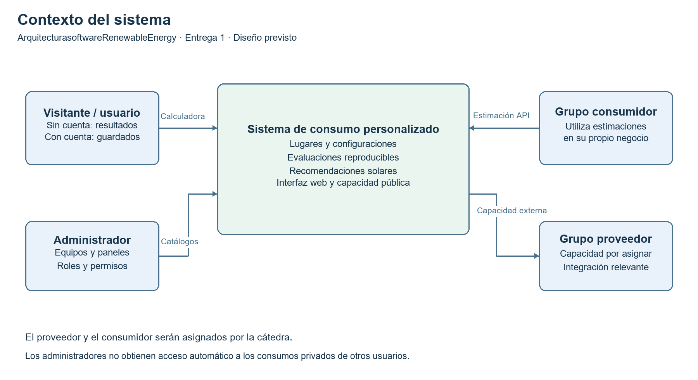
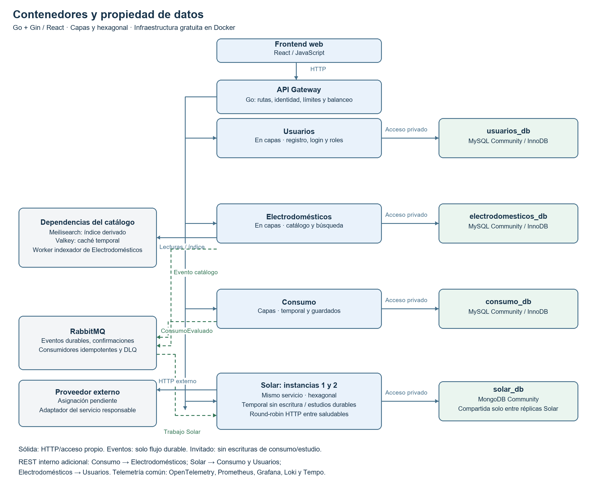

# Arquitectura del sistema

Entrega 1 · versión 1.2.0. Arquitectura decidida para la propuesta; implementación y validación pendientes.

## 1. Contexto

El invitado calcula consumo y recomendación solar sin cuenta ni persistencia. El usuario autenticado gestiona consumos propios y el administrador mantiene catálogos. El grupo consumidor obtiene estimaciones de energía desde una capacidad pública. La capacidad del proveedor asignado se incorporará a un flujo relevante; se propone recurso solar, sin presumir su disponibilidad ni la asignación.

Fuente editable del diagrama: [contexto.mmd](diagrams/contexto.mmd). Las identidades de los grupos externos están pendientes.

## 2. Contenedores

Representación Mermaid equivalente: [contenedores.mmd](diagrams/contenedores.mmd). PNG y Mermaid usan la misma vista simplificada; comunicaciones REST adicionales y telemetría se indican en una nota. El PNG no fue generado automáticamente desde Mermaid. Las flechas sólidas representan solicitudes/acceso a almacenamiento; las discontinuas, eventos. Toda entrada de negocio de la web pasa por el gateway.

## 3. Límites y propiedad

| Servicio | Datos propios | Capacidades | Dependencias |
|---|---|---|---|
| Usuarios | Usuarios, hashes, roles, sesiones/refresh | Registro, login, perfil, logout, rol vigente | MySQL usuarios_db |
| Electrodomésticos | Fichas, categorías, versiones, auditoría, outbox y control del índice | Catálogo, alta administrativa, búsqueda | MySQL propia, Meilisearch, Valkey, RabbitMQ; Usuarios para autorización administrativa |
| Consumo | Lugares, configuraciones, equipos/snapshots, evaluaciones, idempotencia y outbox | Guardar/abrir/editar/duplicar/evaluar; estimación temporal anónima y capacidad M2M | MySQL propia, Electrodomésticos por HTTP, RabbitMQ |
| Solar | Paneles, perfiles, snapshots de evaluación, trabajos, alternativas y resultados | Alta administrativa de paneles, recomendación temporal anónima y estudio durable | MongoDB propia, RabbitMQ, Consumo por HTTP, Usuarios para autorización administrativa, proveedor externo |

Los tres MySQL serán contenedores independientes con usuarios y volúmenes propios; MongoDB pertenece a Solar. Se permiten FK internas en consumo_db; usuarioId y electrodomesticoId no crean FK hacia otras bases. Ningún servicio conoce tablas internas ajenas.

Meilisearch es una proyección reconstruible y Valkey una copia temporal. MySQL conserva la autoridad del catálogo. Solar guarda snapshots para no cambiar recomendaciones históricas cuando se actualiza un panel.

## 4. Arquitectura interna

Usuarios, Electrodomésticos y Consumo tendrán **Handler HTTP → servicio de aplicación/reglas → repositorio/integración**. Gin recibe solicitudes y produce respuestas; las reglas se ubican en la capa de aplicación/dominio; GORM y clientes externos quedan en acceso a datos/integración. No se expone un repositorio directamente a la web.

Solar será **hexagonal**. Su dominio aplica generación, cobertura, cantidad, superficie y selección. Los casos de uso declaran puertos útiles: repositorios, recurso solar, consulta de evaluación y capacidad del proveedor. Gin, consumidor RabbitMQ, worker, driver MongoDB y clientes HTTP son adaptadores. El núcleo no importa tipos Gin/GORM/MongoDB ni modelos del proveedor; los adaptadores traducen hacia tipos propios. El ensamblado se hace al iniciar, sin exigir un framework de inyección.

Un worker es parte del servicio que administra su trabajo, no un nuevo dominio. Capas y hexagonal son los dos estilos; usar Go o Gin no define por sí mismo un estilo arquitectónico.

## 5. Flujos de cálculo

### Invitado: cálculo temporal

Frontend conserva el borrador y resultado solo en memoria. El gateway permite lecturas de catálogos activos y las dos rutas anónimas documentadas en [GUEST-MODE.md](GUEST-MODE.md). Consumo calcula sin repositorio de persistencia; Solar recibe el promedio validado y los parámetros solares, lee sus paneles activos y devuelve una recomendación en la misma solicitud HTTP. Comparte el caso de uso/reglas con su worker durable, pero no llama al puerto de escritura ni a RabbitMQ. Ninguna instancia crea usuario, lugar, configuración, evaluación o estudio para el invitado.

Las solicitudes son síncronas y acotadas: no se simula un job persistente. Si falta información, un proveedor no responde o se excede el deadline, la web conserva el resultado de consumo en memoria y ofrece corregir/reintentar la parte solar. No se crea un resultado recuperable por id. El flujo funciona sin Usuarios, consumo_db y RabbitMQ; Solar sí necesita su catálogo y, cuando corresponda, el recurso externo. La readiness de las rutas invitadas se separa de las rutas durables.

Registrarse o iniciar sesión no guarda nada por sí mismo. Tras volver a la calculadora, la acción Guardar explícita ejecuta el flujo autenticado, valida catálogo vigente y recalcula en backend. Se avisa si los cambios de catálogo modifican la simulación.

### Usuario autenticado: evaluación persistente

1. El usuario autenticado abre o crea configuración de su lugar.
2. Consumo consulta a Electrodomésticos al agregar una ficha activa y guarda su snapshot.
3. La evaluación recibe clave de idempotencia y versiones esperadas de lugar/configuración.
4. En una transacción InnoDB, Consumo bloquea lugar y configuración en orden fijo, verifica versiones y guarda evaluación, idempotencia y evento outbox.
5. Devuelve la evaluación confirmada; el publicador envía ConsumoEvaluado.v1 con confirmación del broker.
6. Solar registra idempotentemente un trabajo pendiente con snapshot y hace ack después de persistirlo.
7. Un worker reclama el estudio atómicamente con lease, obtiene recurso solar y compara paneles.
8. Guarda resultado solo si conserva su token de lease. La web consulta estado y resultado por evaluación.
9. Una nueva cobertura crea otro estudio y consulta la evaluación histórica por API si necesita sus entradas.

Las modificaciones de equipos bloquean la misma configuración e incrementan versión. La misma clave/entrada recupera una evaluación; otra entrada con esa clave da conflicto. Entre bases y broker no hay una transacción distribuida. Se conserva la evaluación aunque tarde o falle el cálculo solar.

## 6. Comunicaciones

| Enlace | Mecanismo / política inicial |
|---|---|
| Web → gateway → servicios | HTTP; calculadora/catálogos activos anónimos limitados; JWT para guardados, perfil e historial y autorización administrativa |
| Consumo → Electrodomésticos | REST, conexión 500 ms, 2 s/intento, una repetición de lectura transitoria, presupuesto total 5 s |
| Solar → Consumo | REST de evaluación inmutable con igual presupuesto |
| Solar/Electrodomésticos → Usuarios | REST de rol vigente antes de una mutación administrativa; 2 s máximo, sin escritura si falla |
| Solar → grupo proveedor | Adaptador directo HTTP; conexión 1 s, 3 s/intento, una repetición de lectura, presupuesto total 8 s |
| Consumo → RabbitMQ → Solar | Evento durable ConsumoEvaluado.v1; entrega al menos una vez; trabajo idempotente |
| Electrodomésticos → RabbitMQ → su indexador | ElectrodomesticoActualizado.v1; cambios y desactivaciones |

Gateway: deadline normal 10 s; no espera terminar un estudio solar ni reintenta escrituras ciegamente. Los reintentos se hacen en una sola capa dueña de la llamada, con jitter y presupuesto total. Una respuesta vencida no confirma un trabajo con lease perdido.

Eventos: eventId, tipo/schemaVersion, fecha y traceId; ConsumoEvaluado incluye propietario, evaluación, configuración/versiones, lugar, período, consumos, ubicación y superficie opcional. Son eventos de hecho confirmado, no el registro canónico de Event Sourcing. Su contrato procesable se formalizará al implementar mensajería; esta entrega formaliza la capacidad HTTP pública.

Outbox con polling, colas durables, mensajes persistentes, publisher confirms y ack manual. Reintentos iniciales de mensajes: 1, 5 y 30 s; inválidos/agotados van a DLQ con alerta, diagnóstico y redrive auditado. Si Solar ya confirmó el trabajo al broker, su recuperación depende de pendientes/leases MongoDB, no de que el mensaje siga en la cola.

## 7. Balanceo y réplicas

El gateway en Go usa net/http/httputil para proxy y un selector explícito round-robin entre solar-1 y solar-2 saludables. DNS de Compose identifica servicios; no se presupone discovery dinámico ni balanceo automático de Gin.

Readiness cada 5 s, timeout 1 s, retirar tras dos fallos y reincorporar tras dos éxitos. Sin destino saludable: 503. Liveness confirma proceso; readiness confirma dependencias indispensables para sus rutas. La caída del proveedor permite consultar resultados guardados y degrada la generación.

**Solar 1 y Solar 2 comparten solar_db porque son ejecuciones del mismo servicio.** Si una guarda un resultado, la otra debe encontrarlo al atender la siguiente consulta. Consumo y Electrodomésticos siguen sin acceder a esa base. Las réplicas de la aplicación no son réplicas de MongoDB: una base única continúa siendo un punto de falla.

## 8. Identidad y seguridad

Usuarios almacena hashes Argon2id con salt y email normalizado único. Registro crea USUARIO. Las claves privadas JWT pertenecen a Usuarios; otros servicios verifican con claves públicas, emisor, audiencia y vencimiento. Access token inicial 15 min, refresh rotativo 7 días y hash en la BD. Access token en memoria del navegador; refresh en cookie HttpOnly, SameSite y CSRF; Secure en HTTPS. Logout revoca refresh; JWT vigente puede durar hasta su expiración.

El gateway define una lista explícita de rutas anónimas de solo lectura/cálculo. No aplica JWT globalmente a toda la web y tampoco publica guardados o administración al abrir el modo invitado. La API M2M mantiene su X-API-Key independiente; ninguna clave se incrusta en React. Cada servicio protege también sus rutas privadas y autoriza por propietario. Altas/modificaciones de catálogos consultan rol/estado vigente; falla de Usuarios impide la escritura administrativa. El administrador no obtiene acceso automático a consumos ajenos. Credenciales M2M de otro grupo solo habilitan la capacidad publicada. No se registran tokens/contraseñas en logs.

## 9. Búsqueda y caché

Meilisearch Community indexa fichas desde eventos: nombre/marca/modelo, categoría, modo, estado y potencia. Tiene campos filtrables/ordenables configurados, páginas de 20 (máximo 100) y orden por relevancia/nombre/potencia con id como desempate. El objetivo inicial de actualización es ≤5 s desde commit hasta visibilidad, incluida finalización de la tarea del motor.

Indexador serial inicial con registro de versión/tarea en MySQL; evita que eventos antiguos reinstalen fichas obsoletas y toma la fuente vigente al recuperarse. No se confunde aceptación de tarea con indexación completa. Reconstrucción en índice nuevo, captura/replay de cambios, validación y swap. Una operación crítica valida ficha autoritativa aunque el índice esté atrasado.

Valkey hace cache-aside de fichas/categorías: TTL inicial 5 min, invalidación tras commit y claves versionadas. Fallo de caché deriva a MySQL con límite de concurrencia. Se medirán hits, misses, p95 y consultas a BD en escenarios equivalentes con/sin caché. La autorización y los datos privados no se almacenan en una caché pública de catálogos.

## 10. Fallas, observabilidad y pruebas previstas

Circuit breaker en llamadas remotas, deadlines, una repetición transitoria y bulkheads. Configuración inicial del circuito: mínimo 10 solicitudes, ventana de conteo de 20, abrir al 50 % de fallos, 30 s de espera y 3 pruebas en recuperación; el adaptador de gobreaker deberá respetar y probar esa semántica.

| Falla | Comportamiento |
|---|---|
| MySQL Usuarios | Sin registro/login/refresh ni mutación administrativa; invitado continúa; JWT conocido vigente permite lecturas autorizadas |
| API catálogo | No agregar sin validar; evaluar snapshots existentes sigue siendo posible |
| MySQL Consumo | No confirmar evaluación/guardado que no pudo persistirse; cálculo invitado sigue disponible |
| RabbitMQ | Eventos esperan en outbox; evaluación confirmada permanece; modo invitado no usa broker |
| MongoDB Solar | No ack antes de persistir; consultas solares informan indisponibilidad |
| Meilisearch / Valkey | Búsqueda indisponible / lectura desde MySQL con protección |
| Proveedor | Circuito y error recuperable; respaldo solo si coincide ubicación/configuración y cumple vigencia documentada |
| Réplica Solar | Retiro del tráfico y recuperación de leases vencidos |

Respaldo solar inicial: hasta 30 días, misma ubicación/período/parámetros; sujeto al contrato real. Logs JSON con servicio, instancia, traceId y evaluación/estudio solo cuando existen en el modo persistente; las rutas invitadas no registran cuerpos, ubicación, equipos ni resultados personales; OpenTelemetry en HTTP y eventos; Prometheus, Grafana OSS, Loki y Tempo locales. Alertas de DLQ, atraso del índice/outbox, estudios demorados, cero réplicas listas y errores. Los ids de negocio están en logs/trazas, no etiquetas de métricas de alta cardinalidad.

Pruebas futuras: invitado sin credenciales, rutas privadas rechazadas, ausencia de escrituras/eventos para cálculo anónimo, cambio a cuenta sin guardado automático y límites de abuso; unitarias de fórmulas/invariantes; integración por servicio con MySQL, MongoDB y RabbitMQ reales; consumidor de contrato externo; carga con k6; caída de proveedor y réplica; recuperación y POSTMORTEM real. No se incluyen informes simulados de resultados.

## 11. Docker y publicación gratuita

Compose contendrá frontend, gateway, cuatro servicios (dos réplicas Solar), tres MySQL, MongoDB, RabbitMQ, Meilisearch, Valkey y observabilidad. Un inicializador idempotente generará secretos locales, migraciones, seeds, índices, colas y administrador inicial aleatorio con cambio obligatorio de contraseña. Se mostrará su credencial solo en la salida local inicial. No habrá pasos manuales obligatorios ni dependencias instaladas en el host fuera de Docker/Compose.

Datos en volúmenes nombrados; compose down sin borrar volúmenes no elimina guardados. Solo la entrada necesaria será pública. El modo local de demostración inicia un proveedor simulado y marca sus datos; la integración real con otro grupo debe verificarse aparte y no queda satisfecha por el mock.

La capacidad pública stateless puede publicarse en Docker con Render Free sin medio de pago, usando una fachada gateway limitada y el mismo cálculo de Consumo; un artefacto cloud podría supervisar ambos procesos en una imagen, manteniendo separados sus roles. No utiliza usuarios/guardados privados ni disco efímero para persistencia. El sistema completo local conserva su despliegue por contenedores separados.

Render Free tiene hibernación, activación en frío y cuotas. URL y disponibilidad están pendientes de validar; no se garantiza operación continua por elegir un plan gratis. Si no cubre el requisito docente, se elegirá otra infraestructura gratuita o institucional. No se habilitarán upgrades ni un medio de pago. Referencias vigentes de estas políticas: [fuentes](REFERENCES.md).

## 12. Limitaciones y deuda técnica aceptada

Datos declarados y fichas orientativas; estimación energética, sin simultaneidad horaria, instalación, baterías o autonomía. No hay aprobación de dominio, grupo externo ni dataset real confirmados. Un gateway, bases/broker únicos son puntos de falla. Dos Solar no equivalen a alta disponibilidad global. No se incorporan Kubernetes ni autoscaling iniciales.

Los recursos mínimos de Docker y los objetivos de latencia deben medirse; no se promete ejecución en hardware insuficiente. Cloud gratis puede suspenderse por cuotas. Quedan pendientes validación del proveedor y formalización de eventos, versión exacta de imágenes, costo operativo en recursos del host y los resultados reales de pruebas.

## 13. Precisiones de diseño de la revisión 1.2.0

### Identidad de estudios solares

EvaluacionId identifica el snapshot de consumo. estudioId identifica cada solicitud solar y configuracionSolarVersion identifica sus parámetros inmutables (cobertura, rendimiento, recurso y superficie). Se define unicidad por `(evaluacionId, configuracionSolarVersion)`, no por la versión de la configuración de consumo. Esto permite varios estudios de una evaluación al cambiar cobertura.

El evento inicial determina una configuracionSolarVersion inicial estable. Su reentrega encuentra el mismo estudio. Las solicitudes posteriores se deduplican por `(propietarioId, operacion, Idempotency-Key)` y conservan hash de entrada: misma clave/entrada recupera el resultado; distinta entrada produce conflicto. La identidad y el hash se guardan en el mismo documento del estudio, con índices únicos; no se promete atomicidad entre documentos separados. Reintentar error conserva estudioId; cambiar parámetros crea otra versión y otro estudio. La consulta por evaluación devuelve la colección de estudios, no un único resultado ambiguo.

### Presupuesto invitado y disponibilidad por capacidad

El gateway permite 10 s, Solar temporal tiene 8 s totales y su adaptador externo como máximo 6 s (hasta dos intentos de 2,5 s con conexión incluida y jitter dentro del límite). Quedan hasta 2 s compartidos entre catálogo, cómputo y serialización. Cada etapa respeta el deadline restante y cancela al agotarlo; no suma un nuevo presupuesto desde cero. El worker durable conserva su presupuesto externo de hasta 8 s por ejecución.

La salud futura se consulta por capacidad: `/health/ready/publico`, `/health/ready/privado` y `/health/ready/admin`. El gateway mantiene conjuntos de instancias aptas por familia de rutas. La ruta temporal no se retira por una caída de RabbitMQ o de Consumo; Solar manual requiere su catálogo, Solar por ubicación además evalúa disponibilidad del recurso y devuelve 503 si falta. La salud del proceso se separa de readiness de negocio. Los esqueletos de esta entrega solo tienen `/health/live` y `/health/ready` genérico: este último devuelve 503 hasta implementar los casos reales.

### Persistencia del trabajo antes del ack

Solar confirma RabbitMQ después de la escritura MongoDB reconocida con journal (`j:true`, write concern explícito). La instancia única del diseño inicial conserva un punto de falla: el journal permite recuperar reinicios con volumen conservado, pero no garantiza sobrevivir a pérdida del disco. Con replica set futuro se revisará write concern majority. No se promete resistencia a pérdida física de todos los datos del host.

### Caché, recursos y alcance

La invalidación del catálogo se reintenta desde el outbox del servicio dueño: un fallo entre commit y borrar la caché no queda silencioso. TTL 5 minutos acota lecturas obsoletas; las decisiones críticas verifican fuente autoritativa. La medición de utilidad sigue pendiente, como exigen las clases y el enunciado.

La implementación se organiza en perfiles: mock (entrega 1), estructura, y posteriormente sistema/observabilidad. Evita exigir todas las dependencias para probar el contrato. Los tres MySQL separados se mantienen como decisión de aislamiento físico; la clase 2 también admite aislamiento lógico. Se reconsiderarán únicamente con medidas de memoria y sin acceso cruzado a bases.
