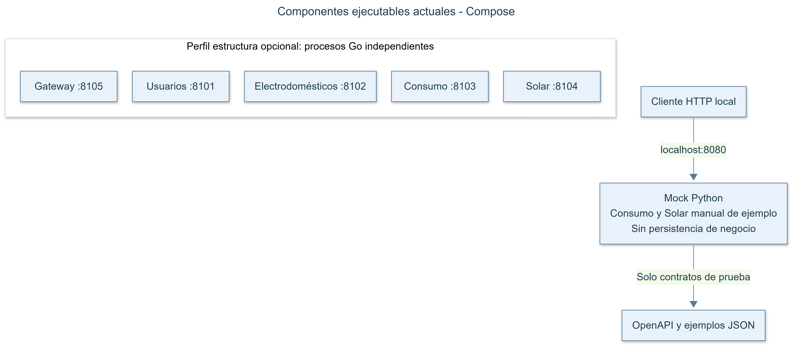

# Revisión de coherencia del proyecto

## Resultado

La documentación no incluye planificación de entregas ni referencias de calendario. Se retiraron también los campos de datación añadidos al diseño de usuarios, catálogos, evaluaciones, estudios y eventos. Las versiones, los propietarios y los identificadores conservan la trazabilidad. Los períodos de consumo, los tiempos de espera, los TTL y los vencimientos de credenciales son parámetros de funcionamiento. La línea temporal del POSTMORTEM requerido por el enunciado se expresa como orden causal y tiempo transcurrido desde el inicio del ensayo.

Se corrigieron las inconsistencias encontradas entre documentos, diagramas, contratos y mock. El sistema actual sigue siendo un mock local ejecutable y cinco servidores Go iniciales; las funciones productivas no implementadas continúan indicadas como pendientes.

## Correcciones

| Hallazgo | Corrección |
|---|---|
| Planificación y referencias de calendario añadidas al proyecto | Se retiraron la tabla de entregas, el orden sugerido de desarrollo y los campos de datación no exigidos por el enunciado. |
| La propuesta de la raíz enlazaba una carpeta inexistente y duplicaba la propuesta de docs | La raíz ahora apunta a una única propuesta canónica y a las guías vigentes. |
| OpenAPI decía que el mock y la entrada local estaban pendientes | Ambos contratos describen correctamente el mock en localhost y distinguen la implementación productiva pendiente. Revisión de contrato 1.0.1. |
| D8 todavía citaba solamente la versión inicial 1.0.0 del contrato | Se indica 1.0.1 como versión vigente y se conserva la referencia a la versión inicial. |
| La propuesta hablaba de crear el repositorio y agrupaba documentación existente como futura | Se distinguen los documentos locales incluidos de los artefactos pendientes. |
| Diagramas duplicados en propuestas, fuentes Mermaid y PNG mantenidos por separado | Las propuestas y arquitectura usan las mismas imágenes y fuentes canónicas. Los PNG se generaron desde Mermaid y se inspeccionaron. |
| El diagrama simplificado no mostraba el consumo de cambios del catálogo | Se añadió RabbitMQ → indexador de Electrodomésticos. El servicio sigue siendo dueño de su índice y su base. |
| La vista de contenedores futuros podía confundirse con el Compose actual | Se añadieron títulos explícitos y una vista de los componentes ejecutables actuales, sin conexiones de negocio ficticias. |
| Contexto agrupaba visitante y usuario, mientras otros documentos los diferenciaban | La vista de contexto distingue invitado, usuario autenticado, administrador, grupo consumidor y grupo proveedor pendiente. |
| Tabla de llamadas externas no separaba Solar durable e invitado | Se unificaron los presupuestos: proveedor durable hasta 8 s; proveedor invitado hasta 6 s dentro de los 8 s totales de Solar temporal. |
| Readiness invitada podía interpretarse como inmune a una caída de la API Consumo | Se aclaró que consumo_db y RabbitMQ no bloquean cálculo temporal; la API Consumo sí es necesaria para calcular un consumo nuevo. Solar puede utilizar un promedio ya disponible. |
| El ADR invitado hablaba de procesamiento durable existente | Se aclaró que es parte del diseño previsto. |
| La política de compatibilidad sugería extensiones libres pese a additionalProperties=false | Los campos nuevos requieren contrato acordado y actualización de consumidores antes de emitirse. |
| Una solicitud Solar válida sin límite de superficie podía producir una salida fuera de su propio esquema | Se retiró la cota incorrecta de superficie de salida. Se conserva el límite de superficie disponible de entrada; fórmulas, unidades y campos no cambian. |
| El mock devolvía detalles vacíos aunque la guía requería señalar el campo inválido | Los errores de esquema, días, ids y precisión indican campo y motivo sin devolver los valores de entrada. |
| Revisión de pruebas mezclaba cifras de ejecuciones anteriores | La evidencia actual informa 21 pruebas del mock y conserva los límites de validación. |

## Diagramas revisados

La dirección de las flechas expresa quién inicia la interacción. Todos los actores web pertenecen al contexto; el proveedor externo es una dependencia consumida por el sistema, cuya asignación sigue pendiente. El administrador gestiona catálogos y roles y no obtiene acceso automático a consumos privados ajenos.

Cada base pertenece a un servicio. Las dos instancias Solar son réplicas de un mismo servicio y comparten solamente solar_db. Las flechas discontinuas representan publicación/consumo de eventos; RabbitMQ no escribe directamente en bases ni en el índice. El indexador es parte de Electrodomésticos. Algunas llamadas REST y la telemetría se describen en [la arquitectura](ARCHITECTURE.md) y en [la guía de diagramas](diagrams/README.md) para mantener legible la vista simplificada.

El mock atiende solicitudes HTTP en localhost:8080. El perfil estructura agrega los servidores Go en los puertos 8101–8105, sin proxy entre ellos. Las líneas invisibles de su fuente Mermaid solo ordenan las cajas; no representan conexiones. El perfil verificar ejecuta las pruebas aisladas del mock. La vista corresponde a la configuración actual; no constituye evidencia de que Docker haya arrancado los contenedores.

## Verificación

- 21 pruebas HTTP del mock aprobadas, incluidos los dos nuevos casos sobre superficie solar extrema y detalles de campos inválidos.
- go test y go vet aprobados en los cinco módulos Go.
- Configuración de todos los perfiles Compose validada mediante el lanzador PowerShell con config --quiet.
- Los dos contratos OpenAPI 3.0.3 y sus ejemplos embebidos validados con una biblioteca independiente.
- Schemas de consumo compartidos entre contrato M2M e invitado comparados sin diferencias; M2M mantiene API key y el invitado mantiene acceso anónimo.
- Todos los enlaces Markdown locales comprobados después de corregir las referencias.
- Las tres fuentes Mermaid renderizadas con Mermaid CLI 12.0.0, con PNG revisados visualmente y sin metadatos de calendario.
- Búsqueda de referencias de calendario concretas en documentos, evidencias, configuración, fuentes y código: sin coincidencias en el contenido vigente.

Las comprobaciones de estructura y coherencia complementan las pruebas de ejecución. No demuestran funcionalidades que todavía no existen.

## Límites pendientes

El frontend, login, repositorios, migraciones reales, búsqueda, caché, mensajería, proxy y balanceo de negocio siguen pendientes. No se ejecutaron pruebas de integración contra MySQL, MongoDB, RabbitMQ o el proveedor externo; tampoco pruebas de carga ni una caída controlada. El motor Docker no estaba disponible para probar build y arranque de contenedores. Los lanzadores Unix no se probaron en Linux/macOS. La asignación docente, aprobación del dominio y publicación remota tampoco están verificadas.

Se revisaron los archivos de trabajo del proyecto; no se reescribió la historia Git ni se modificaron el PDF o los apuntes externos. El informe y la auditoría anterior reflejan el contenido vigente.
